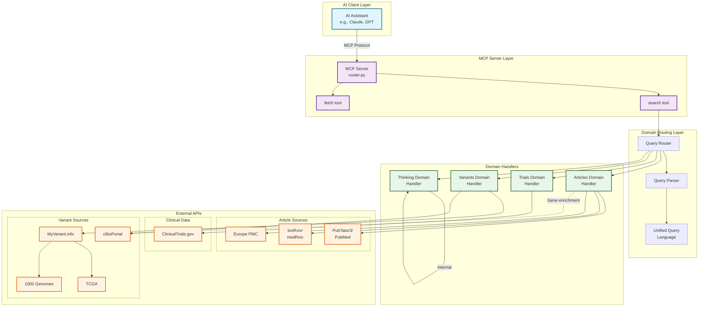
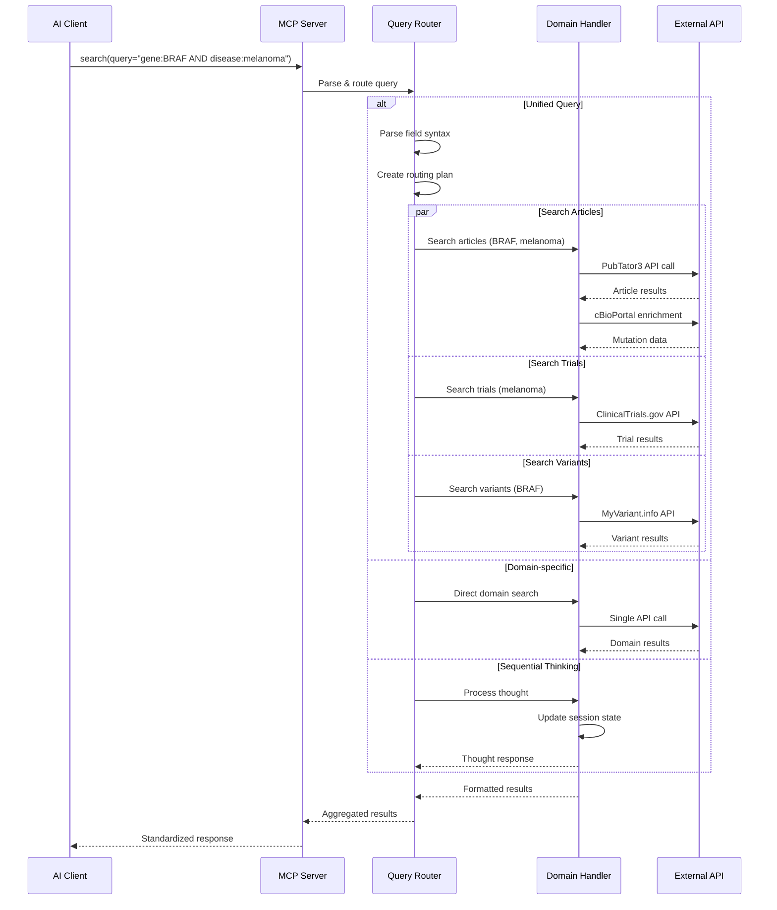
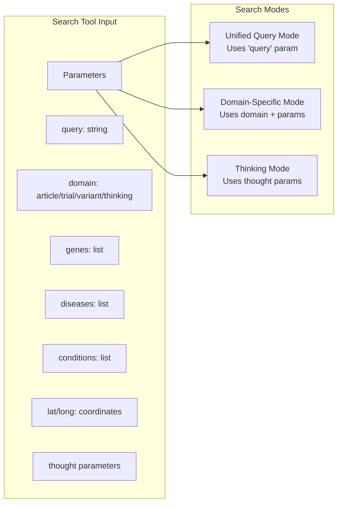
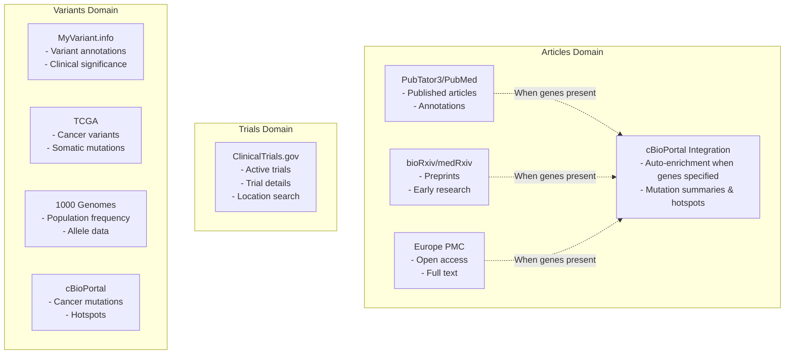
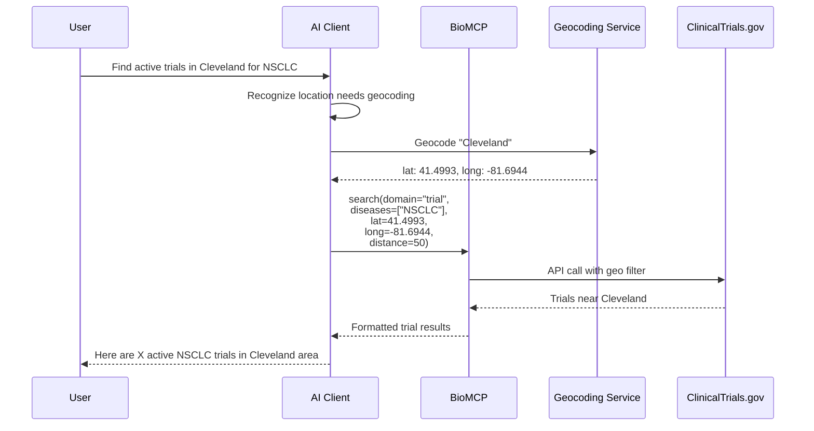

# BioMCP Data Flow Diagram

This document illustrates how BioMCP (Biomedical Model Context Protocol) works, showing the interaction between AI clients, the MCP server, domains, and external data sources.

## High-Level Architecture



## Detailed Search Flow



## Search Tool Parameters



## Domain-Specific Data Sources



## Unified Query Language

```mermaid
graph TD
    QUERY[Unified Query<br/>"gene:BRAF AND disease:melanoma"]

    QUERY --> PARSE[Query Parser]

    PARSE --> F1[Field: gene<br/>Value: BRAF]
    PARSE --> F2[Field: disease<br/>Value: melanoma]

    F1 --> D1[Articles Domain]
    F1 --> D2[Variants Domain]
    F2 --> D1
    F2 --> D3[Trials Domain]

    D1 --> R1[PubMed Results]
    D2 --> R2[Variant Results]
    D3 --> R3[Trial Results]

    R1 --> AGG[Aggregated Results]
    R2 --> AGG
    R3 --> AGG
```

## Example: Location-Based Trial Search



## Key Features

1. **Parallel Execution**: Multiple domains are searched simultaneously for unified queries
2. **Smart Enrichment**: Article searches automatically include cBioPortal mutation summaries when genes are specified, providing clinical context alongside literature results
3. **Location Awareness**: Trial searches support geographic filtering with lat/long coordinates
4. **Sequential Thinking**: Built-in reasoning system for complex biomedical questions
5. **Standardized Output**: All results follow OpenAI MCP format for consistency

## Response Format

All search results follow this standardized structure:

```json
{
  "results": [
    {
      "id": "PMID12345678",
      "title": "BRAF V600E mutation in melanoma",
      "text": "This study investigates BRAF mutations...",
      "url": "https://pubmed.ncbi.nlm.nih.gov/12345678"
    }
  ]
}
```

Fetch results include additional domain-specific metadata in the response.
