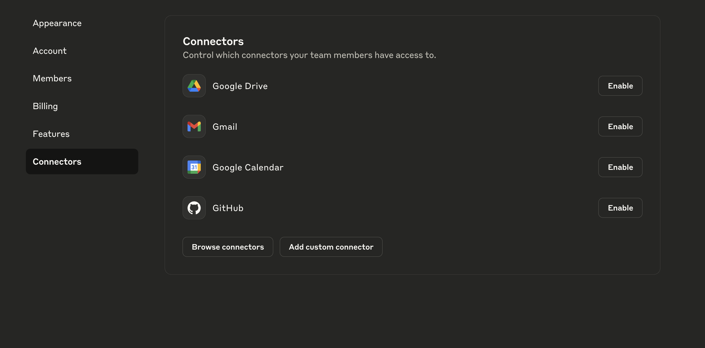
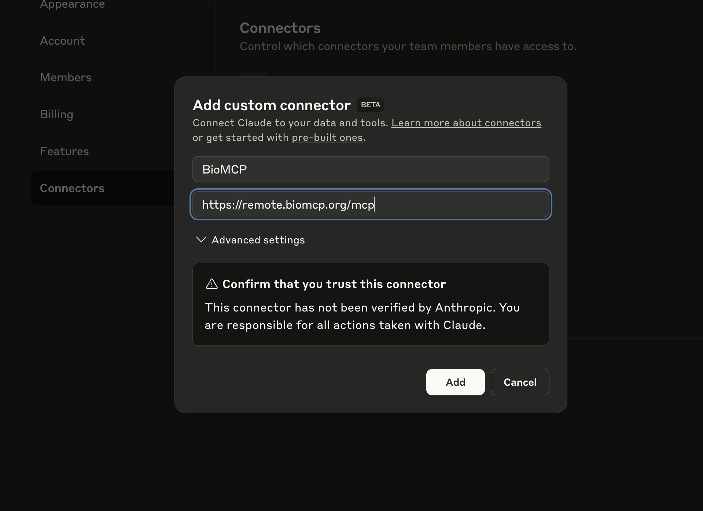
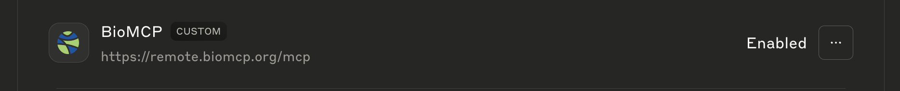
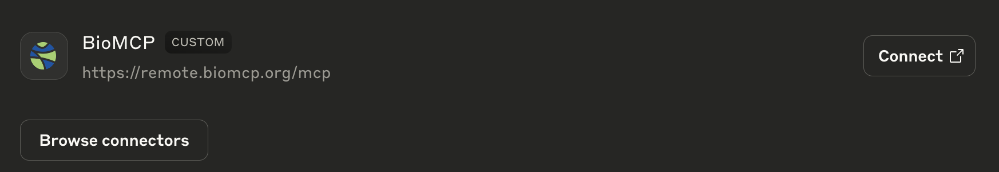
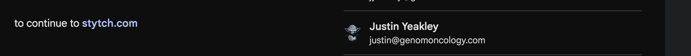
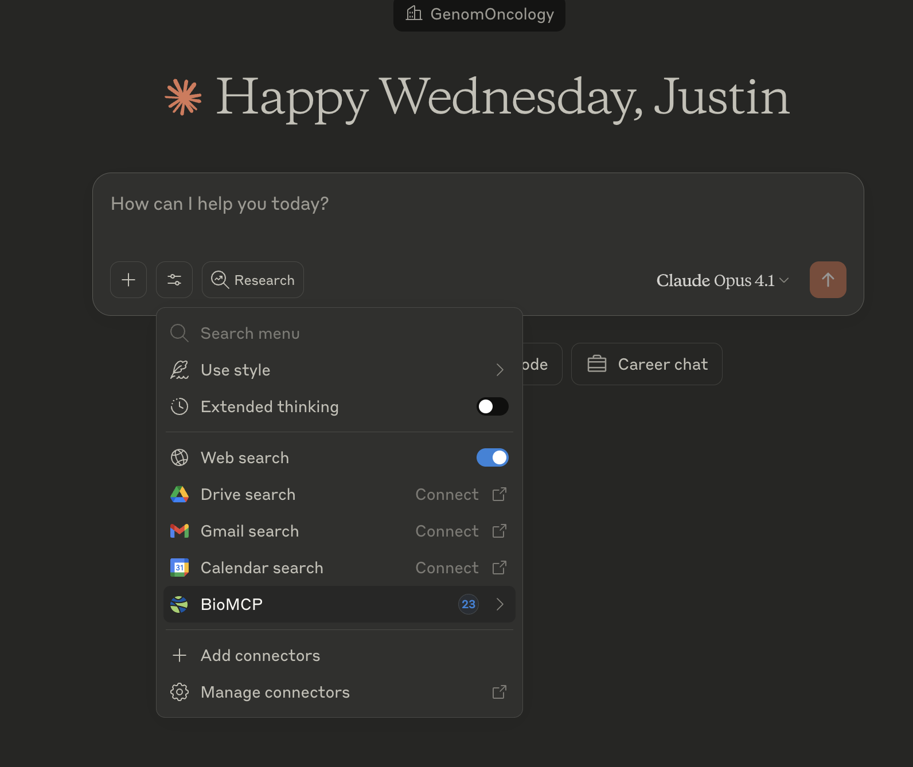

# Connecting to Remote BioMCP

This guide walks you through connecting Claude to the remote BioMCP server, providing instant access to biomedical research tools without any local installation.

## Overview

The remote BioMCP server (https://remote.biomcp.org/mcp) provides cloud-hosted access to all BioMCP tools. This eliminates the need for local installation while maintaining full functionality.

!!! success "Benefits of Remote Connection" - **No Installation Required**: Start using BioMCP immediately - **Always Up-to-Date**: Automatically receive the latest features and improvements - **Cloud-Powered**: Leverage server-side resources for faster searches - **Secure Authentication**: Uses Google OAuth for secure access

!!! info "Privacy Notice"
We log user emails and queries to improve the service. All data is handled according to our privacy policy.

## Step-by-Step Setup

### Step 1: Access Custom Connectors

Navigate to the **Custom Connectors** section in your Claude interface. This is where you'll configure the connection to BioMCP.



### Step 2: Add Custom Connector

Click the **Add Custom Connector** button and enter the following details:

- **Name**: BioMCP
- **URL**: `https://remote.biomcp.org/mcp`



### Step 3: Verify Connector is Enabled

After adding, you should see BioMCP listed with an "Enabled" status. This confirms the connector was added successfully.



### Step 4: Connect to BioMCP

Return to the main Connectors section where you'll now see BioMCP available for connection. Click the **Connect** button.



### Step 5: Authenticate with Google

You'll be redirected to Google OAuth for authentication. Sign in with any valid Google account. This step ensures secure access to the service.



!!! note "Authentication" - Any valid Google account works - Your email is logged for service improvement - Authentication is handled securely through Google OAuth

### Step 6: Connection Success

Once authenticated, you'll see a successful connection message displaying the available tool count. As of January 2025, there are 23 tools available (this number may increase as new features are added).



## Verifying Your Connection

After successful connection, you can verify BioMCP is working by asking Claude:

```
What tools do you have available from BioMCP?
```

Claude should list the available tools including:

- Article search and retrieval (PubMed/PubTator3)
- Clinical trials search (ClinicalTrials.gov and NCI)
- Variant analysis (MyVariant.info)
- Gene, drug, and disease information
- Sequential thinking for complex research

## Troubleshooting

### Connection Failed

- Ensure you entered the URL exactly as shown: `https://remote.biomcp.org/mcp`
- Check your internet connection
- Try disconnecting and reconnecting

### Authentication Issues

- Make sure you're using a valid Google account
- Clear your browser cache if authentication hangs
- Try using a different browser if issues persist

### Tools Not Available

- Disconnect and reconnect to BioMCP
- Refresh your Claude session
- Contact support if tools remain unavailable

## Next Steps

Now that you're connected to BioMCP, you can:

1. **Search biomedical literature**: "Find recent papers on BRAF mutations in melanoma"
2. **Analyze clinical trials**: "What trials are recruiting for lung cancer with EGFR mutations?"
3. **Interpret variants**: "What is the clinical significance of TP53 p.R273H?"
4. **Explore drug information**: "Tell me about pembrolizumab's mechanism and indications"

## Support

For issues or questions about the remote BioMCP connection:

- GitHub Issues: [https://github.com/genomoncology/biomcp/issues](https://github.com/genomoncology/biomcp/issues)
- Documentation: [https://biomcp.org](https://biomcp.org)
